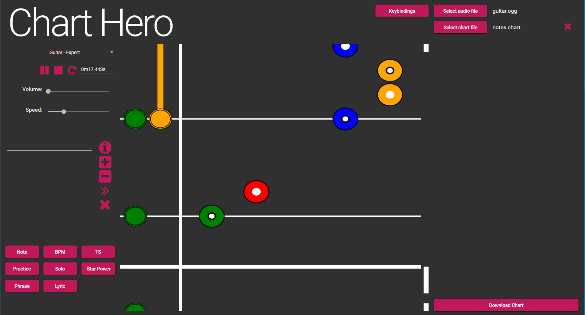

# Chart Hero 1.1.0

Chart Hero is a web based chart editing application for Guitar Hero style rhythm games. With Chart Hero, you can create new custom charts in your browser on any desktop operating system. 

Head to https://nb48.github.io/chart-hero/ to check out the application. All you need is an audio file. (.mp3, .ogg, or anything else your browser supports)

There are some examples here - https://drive.google.com/open?id=1T5JM1XR1tfY1WS6N4kgyKyeFU94zLd5Z

If you have any questions, join us on [Discord!](https://discord.gg/UJNFxhM)



## Running

```
git clone git@github.com:nb48/chart-hero.git
cd chart-hero
yarn install
yarn start
```

This starts the application at http://localhost:9000

## Testing

```
yarn test
```

## Building

```
yarn build
yarn serve
```

This serves an optimized version of the application at http://localhost:9001

## Built With

* [Angular](https://github.com/angular)
* [TypeScript](https://github.com/Microsoft/TypeScript)
* [webpack](https://github.com/webpack)
* [howler.js](https://github.com/goldfire/howler.js)

## Styled With

* [Angular Material](https://material.angular.io/)

## License

This project is licensed under the MIT License - see the [LICENSE.md](LICENSE.md) file for details

## Acknowledgments

Thanks to the Guitar Hero community for helping to design, test, and improve Chart Hero
